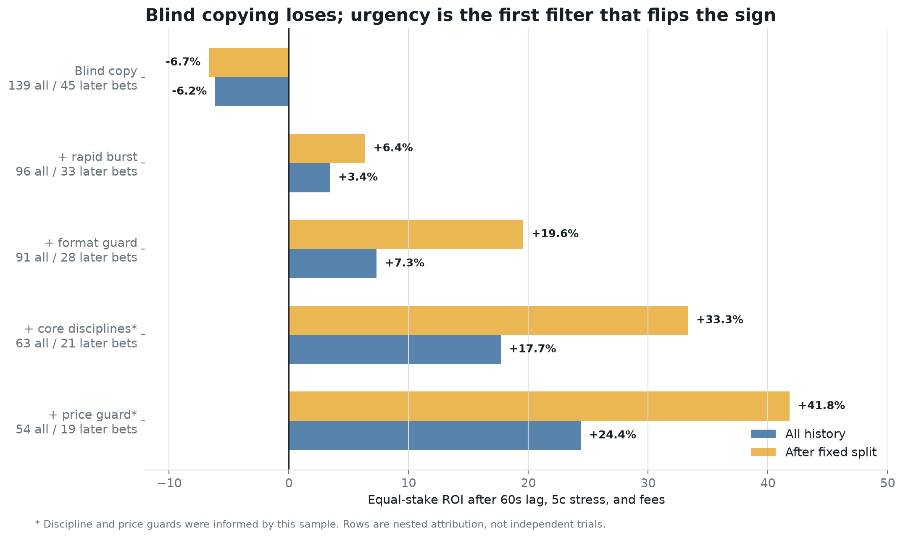
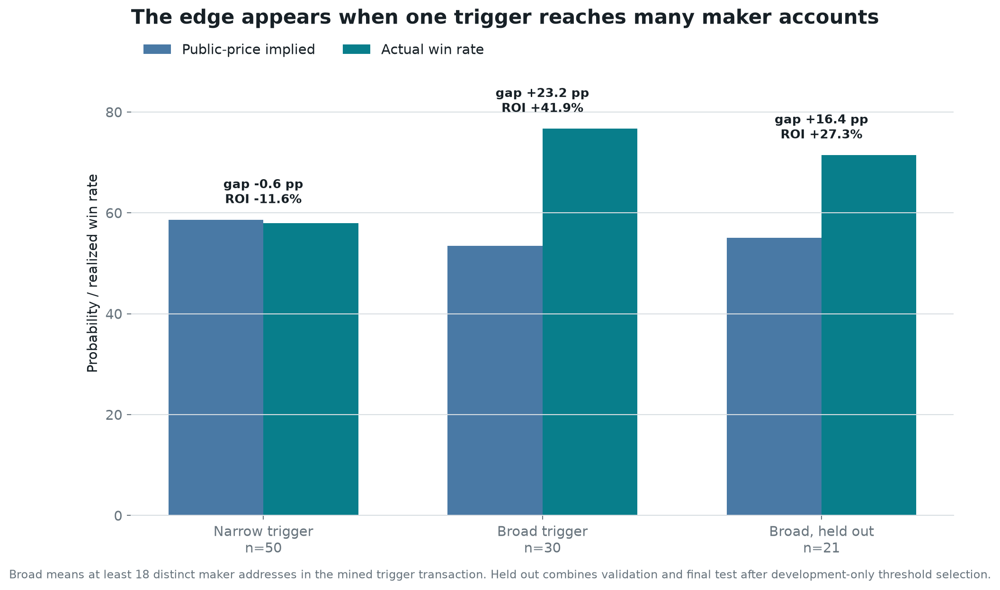
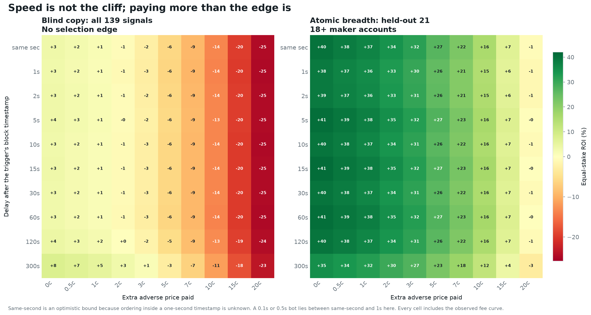

# Polymarket Trader Research: `@djdjdjekekek`

Transaction-level investigation of a high-volume Polymarket account. The repository reconstructs wallet control, cash flows, maker/taker roles, decoded trigger calldata, market outcomes, realistic copy-execution surfaces, peer activity, and a leakage-controlled paper strategy.

## Start Here: No Code Required

**[Read the illustrated plain-English essay (PDF)](research/djdjdjekekek/plain_english_essay.pdf)**

The PDF explains what blind copying would have done, the atomic-liquidity fingerprint that best identifies the trader's edge, what a same-second copy bot changes, and why the evidence is still not strong enough for live money. A responsive [browser edition](research/djdjdjekekek/plain_english_essay.html) is included as well.

Profile: [polymarket.com/@djdjdjekekek](https://polymarket.com/@djdjdjekekek)

## Read This First

1. [Breakthrough audit](research/djdjdjekekek/breakthrough_report.md) - the discovery, falsification tests, failed hypotheses, and decision.
2. [Replication report](research/djdjdjekekek/replication_report.md) - exact signal, execution assumptions, sensitivity, and paper monitor.
3. [Deep trader report](research/djdjdjekekek/trader_report.md) - full execution reconstruction and case studies.
4. [Onchain report](research/djdjdjekekek/onchain_report.md) - controller proof, funding graph, and cash reconciliation.
5. [Executive summary](research/djdjdjekekek/report.md) - one-page synthesis.

## Discovery

The account has two execution layers. Small maker fills dominate row count, while large fee-paying taker sweeps dominate capital and carry the directional information.

The deeper finding is more specific: **one mined trigger transaction becomes unusually informative when it consumes offers from at least 18 distinct signed maker accounts.** All 149 trigger transactions were decoded from Polygon. Every one was a successful V2 `matchOrders` BUY with the target as taker, revealing structure hidden by the public trade feed.

| Finding | Result |
| --- | ---: |
| Coverage | 28,235 fills, 386 markets, 396 closed positions |
| Confirmed cash extracted above deposits | $5.91M |
| Maker execution | 92.8% of fills, 27.9% of quote notional |
| Taker execution | 7.2% of fills, 72.1% of quote notional |
| Markets with at least 50% taker notional | +23.76% capital-weighted ROI |
| True multi-map series | +$7.57M, +31.20% ROI |
| Single game/map including BO1 | -$4.89M, -57.55% ROI |
| BO1 rows previously mislabeled as series | 9 markets, -$1.78M, -67.80% ROI |
| Blindly copy every canonical $25K signal | 139 bets, -$855.28 P&L, -6.15% ROI; -6.68% later |
| Triggers matching fewer than 18 makers | 50 bets, 29 wins, -11.56% ROI |
| Atomic breadth of at least 18 makers | 30 bets, 23 wins, +41.94% ROI |
| Breadth rule after development selection | 21 bets, 15 wins, +27.32% ROI |
| One-second blind-copy break-even allowance | 1.53 cents of adverse price |
| One-second breadth held-out allowance | 19.12 cents of adverse price |

These are research results, not production evidence. The breadth cutoff was selected on the first half only; the combined held-out half returned +27.32%, with a day-clustered interval of +0.73% to +58.28%. The threshold-search null simulation gives one-sided `p=0.046`, but it does not correct wallet or feature-family selection.

## What Changed In The Deep Pass

### A Semantic Bug Was Exposed

`(BO1)` had been classified as a series winner. A best-of-one is one map, and those nine markets lost $1.78M. Correcting the label sharpens the account's largest failure mode: multi-map series were highly profitable, while one-map exposure was destructive.

The correction was noticed while inspecting final-period losses. It is domain-correct and consistent with the pre-existing map exclusion, but it is disclosed rather than presented as a pristine holdout discovery.

### The Execution Backtest Was Rebuilt

The old prototype used the target's next future BUY as an execution proxy. The rebuilt test uses 143,507 market-wide taker prints across 149 signal markets:

- test same-second, 1, 2, 5, 10, 15, 30, 60, 120, and 300-second entry;
- use the first direction-neutral unrelated public print in the next minute;
- force no-print signals into the test with a trigger-price fallback;
- cross each delay with 0, 0.5, 1, 2, 3, 5, 7, 10, 15, and 20 cents of adverse price, plus the account-observed 3% fee curve;
- retain only the first eligible condition per canonical event;
- use equal stakes so target sizing cannot leak into the result.

The historical tape has one-second timestamps, so 0.1-second and 0.5-second bots cannot be distinguished. The clock starts when the transaction is mined because maker breadth requires decoded on-chain calldata; Polymarket's earlier off-chain `MATCHED` state is a different, untested signal. Same-second/no-penalty blind copy returns only +3.4%; one second plus one cent returns +1.0%; one second plus two cents returns -0.9%. Blind copying has no measured sub-minute latency cliff. It has an execution-price cliff near two cents.

The nested universe test identifies where the result comes from:

| Rule | All-period ROI | ROI after fixed split |
| --- | ---: | ---: |
| Every canonical $25K signal | -6.15% | -6.68% |
| Add rapid 60-second burst | +3.42% | +6.36% |
| Add map/short-market exclusion | +7.33% | +19.57% |
| Add core disciplines | +17.69% | +33.32% |
| Add 0.30-0.85 price guard | +24.37% | +41.82% |

This is a nested attribution ladder, not five independent trials. Discipline and price were informed by the same investigated sample; urgency and format are the more defensible core.



### The Mechanism Was Decoded

Rapid buying was the first useful clue: signals where most aggressive buying arrived within 60 seconds returned +24.37%, versus -24.46% for slower accumulation. But the rapid rule lost -25.91% in its middle validation block, so urgency alone was not the final mechanism.

Decoding the V2 `matchOrders` maker array exposed the stronger feature. The typical trigger matched 19 maker orders from 14 distinct maker accounts; 66 of 149 crossed multiple price levels. At least 18 distinct makers selected 30 bets with 23 wins, versus 29 wins from 50 narrower triggers. Public prices implied 16.04 wins for the broad group and 29.30 for the narrow group.

The breadth rule's calibration gap is +23.21 points, compared with -0.59 below the cutoff. A fine permutation within discipline, three price bands, and chronological period gives a +28.03-point effect across 63 comparable bets (`p=0.0064`). Resampling whole trading days puts the broad-minus-narrow gap at +23.80 points, with a +6.19 to +42.81 interval.

The effect is not just a bigger dollar trade. A probability-offset model controlling rapid flow, trigger notional, and time period estimates 4.94 times the outcome odds for breadth (`p=0.043`); trigger notional itself is null (`p=0.858`). The candidate edge is therefore **informed liquidity demand expressed as atomic maker breadth**, not proven private information.





The target's eventual position cannot be inferred reliably from the initial signal. A chronological sizing model has negative out-of-sample `R^2`, so the paper prototype uses fixed fractional sizing.

### The Leader-Wallet Hypothesis Failed

Fourteen recurring wallets were traced across the same markets. Some overlaps are striking, especially `SPCEXBUYER`, but no wallet consistently leads and agrees. Peer confirmation selected from the early period underperformed the no-confirmation group later, so peer identity is deliberately excluded from the model.

## Onchain Result

The public profile resolves to deposit wallet `0x6D20...a165`, a Polymarket `POLY_1271` wallet rather than a Gnosis Safe. Three independent contract surfaces resolve control to EOA `0xC332...141b`:

- `owner()`;
- the address encoded in `id()`;
- the sole `OwnershipTransferred` initialization event.

That EOA directly transacted with an EIP-7702 source account responsible for $29.56M across 358 funding transactions. Large deposit and withdrawal routers are classified as infrastructure, not attributed to a natural person.

## Repository Map

Core pipeline:

- `src/trader_research.js` - CLI orchestration.
- `src/research/collect.js` - public Polymarket collection with windowed pagination.
- `src/research/onchain.js` - wallet control, contract state, logs, and flow decoding.
- `src/research/analyze.js` - fill reconstruction, accounting, format classification, timing, and event grouping.
- `src/research/tape.js` - compact market-wide taker-tape collector.
- `src/research/trigger_transactions.js` - Polygon V2 calldata decoder and atomic-sweep reconstruction.
- `src/research/statistical_analysis.py` - robust regression and event-cluster bootstrap.
- `src/research/edge_analysis.py` - external execution, latency-cost surfaces, atomic-breadth tests, falsification, sizing, and modeling.
- `src/research/peer_analysis.py` - recurring-wallet and chronological leader audit.
- `src/research/report_graphics.py` - reproducible PNG/SVG figures from committed artifacts.
- `src/research/replicator.js` - model-scored paper-intent state machine.
- `src/research/report.js` - reproducible Markdown reports.

Primary evidence:

- `snapshot.json`, `enrichment.json`, and `deep_analysis.json` - source snapshot and reconstructed account behavior.
- `market_tape.json` - 143,507 compact external public prints.
- `trigger_transactions.json` - decoded V2 trigger calldata, maker arrays, prices, order ages, and reconciliation.
- `edge_features.csv`, `edge_analysis.json`, and `edge_model.json` - signal table, tests, and frozen model.
- `peer_evidence.json` - recurring-wallet evidence and chronology test.
- `figures/` - strategy funnel, calibration, equity, threshold, and execution graphics.
- `onchain_evidence.json` and `flow_transactions.json` - decoded chain evidence.
- `replication_backtest.json`, `replicator_config.json`, and `replication_intents.json` - prototype audit and output.

All generated artifacts are under `research/djdjdjekekek/`.

## Setup

Node.js 20+ and Python 3.11+ are recommended.

```bash
npm install
python3 -m venv .venv
.venv/bin/pip install -r requirements-analysis.txt
```

## Reproduce Saved Analysis

The committed snapshot and market tape can be analyzed without recollecting public data:

```bash
npm run research:analyze
PYTHON=.venv/bin/python npm run research:stats
PYTHON=.venv/bin/python npm run research:edge
PYTHON=.venv/bin/python npm run research:graphics
npm run research:replicate
npm run research:report
```

`npm run research:peers` refreshes peer profiles and trades from the public API. A complete network refresh is:

```bash
PYTHON=.venv/bin/python npm run research:all
```

Useful individual commands:

```bash
npm run research:collect
npm run research:enrich
npm run research:onchain
npm run research:tape
npm run research:triggers
npm run research:peers
npm run research:monitor
```

## Frozen Research Algorithm

`atomic-breadth-18` requires:

- at least $25,000 of concentrated target taker BUY flow;
- at least 70% net directional concentration;
- trigger price from 0.30 to 0.85;
- an allowed discipline and no single-game/map, BO1, or short-horizon market;
- one condition per canonical event;
- decoded V2 `matchOrders` calldata with the target as BUY taker;
- at least 18 distinct `makerOrders[].maker` addresses in that trigger;
- immediate paper submission with actual end-to-end latency and depth recorded;
- a declared maximum adverse price, fixed before seeing the outcome;
- a fixed $100 paper stake with no outcome-dependent sizing.

At least 80% of target taker flow in the final minute is a confidence tag, not a second hard gate. The current JavaScript monitor predates trigger-calldata decoding and must not be represented as an implementation of this frozen rule. The next prospective runner must reject undecoded triggers and record FOK failures, partial fills, indexer delay, and actual depth.

## Verification

```bash
npm test
find src -name '*.js' -exec node --check {} \;
.venv/bin/python -m py_compile src/research/*.py
```

## Integrity And Limits

- Maker/taker role comes from exact `takerOnly=true` transaction hashes.
- Activity cash corrects maker sub-fills exposed by the public trade feed.
- The official fee curve independently checks role classification.
- External execution selection never depends on a later target fill or outcome.
- No-print signals are forced into the primary test to avoid fill-selection bias.
- Outcome labels enter walk-forward training only after Gamma market `closedTime`, with 100% signal-market coverage; the ambiguous closed-position timestamp is not used.
- Correlated uncertainty is clustered by canonical event or trading day.
- Wallet selection, short history, public-tape depth, and winner concentration remain material limitations.

This repository investigates public addresses and market behavior. It does not identify a natural person, establish an information source, or provide financial advice.
