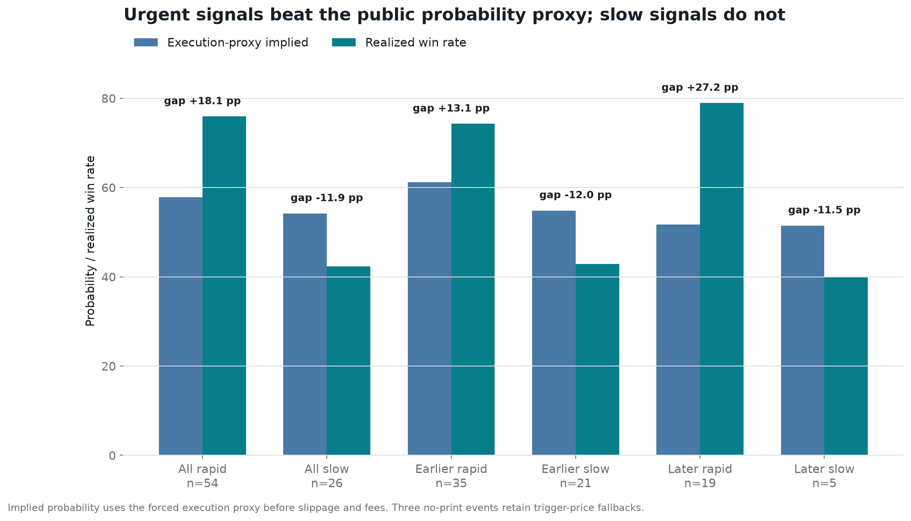

# Polymarket Trader Research: `@djdjdjekekek`

Transaction-level investigation of a high-volume Polymarket account. The repository reconstructs wallet control, cash flows, maker/taker roles, market outcomes, external execution prices, peer activity, and a leakage-controlled paper strategy.

Profile: [polymarket.com/@djdjdjekekek](https://polymarket.com/@djdjdjekekek)

## Read This First

1. [Breakthrough audit](research/djdjdjekekek/breakthrough_report.md) - the discovery, falsification tests, failed hypotheses, and decision.
2. [Replication report](research/djdjdjekekek/replication_report.md) - exact signal, execution assumptions, sensitivity, and paper monitor.
3. [Deep trader report](research/djdjdjekekek/trader_report.md) - full execution reconstruction and case studies.
4. [Onchain report](research/djdjdjekekek/onchain_report.md) - controller proof, funding graph, and cash reconciliation.
5. [Executive summary](research/djdjdjekekek/report.md) - one-page synthesis.

## Discovery

The account has two execution layers. Small maker fills dominate row count, while large fee-paying taker sweeps dominate capital and carry the directional information.

The deeper finding is more specific: **rapid, concentrated target taker sweeps in full-match or multi-map markets retain a delayed, execution-sensitive signal in unrelated public market prints.**

| Finding | Result |
| --- | ---: |
| Coverage | 28,235 fills, 386 markets, 396 closed positions |
| Confirmed cash extracted above deposits | $5.91M |
| Maker execution | 92.8% of fills, 27.9% of quote notional |
| Taker execution | 7.2% of fills, 72.1% of quote notional |
| Markets with at least 50% taker notional | +23.76% capital-weighted ROI |
| True multi-map series | +$7.57M, +31.20% ROI |
| Single game/map including BO1 | -$4.89M, -57.55% ROI |
| BO1 rows previously mislabeled as series | 9 markets, -$1.78M, -67.80% ROI |
| Blindly copy every canonical $25K signal | 139 bets, -$855.28 P&L, -6.15% ROI; -6.68% later |
| Forced external-tape test | 80 bets, +8.50% ROI |
| Chronological final 30% | 24 bets, +26.36% ROI |
| Keep BO1 eligible as originally classified | 84 bets, +5.27% overall; 28 later bets, +14.09% |
| Expanding-window model | 15 selected bets, +27.54% ROI, 0.635 ROC-AUC |

These are research results, not production evidence. The final-period day-clustered 95% interval is -15.9% to +55.8%; the model interval is -13.3% to +69.4%. Both cross zero, and removing the top five winners makes aggregate and model ROI negative.

## What Changed In The Deep Pass

### A Semantic Bug Was Exposed

`(BO1)` had been classified as a series winner. A best-of-one is one map, and those nine markets lost $1.78M. Correcting the label sharpens the account's largest failure mode: multi-map series were highly profitable, while one-map exposure was destructive.

The correction was noticed while inspecting final-period losses. It is domain-correct and consistent with the pre-existing map exclusion, but it is disclosed rather than presented as a pristine holdout discovery.

### The Execution Backtest Was Rebuilt

The old prototype used the target's next future BUY as an execution proxy. The new test uses 143,507 market-wide taker prints across 149 signal markets:

- wait 60 seconds after a fixed $25,000 concentrated target-taker signal;
- use the first direction-neutral unrelated public print in the next minute;
- force no-print signals into the test with a trigger-price fallback;
- add five cents adverse slippage and the account-observed 3% fee curve;
- retain only the first eligible condition per canonical event;
- use equal stakes so target sizing cannot leak into the result.

The target side beats the opposite side (-46.03% ROI) and randomized sides (one-sided `p=0.0301`) in the final slice. At ten cents adverse stress, however, all-period ROI is approximately flat. Execution quality can consume the entire observed edge.

The nested universe test identifies where the result comes from:

| Rule | All-period ROI | ROI after fixed split |
| --- | ---: | ---: |
| Every canonical $25K signal | -6.15% | -6.68% |
| Add rapid 60-second burst | +3.42% | +6.36% |
| Add map/short-market exclusion | +7.33% | +19.57% |
| Add core disciplines | +17.69% | +33.32% |
| Add 0.30-0.85 price guard | +24.37% | +41.82% |

This is a nested attribution ladder, not five independent trials. Discipline and price were informed by the same investigated sample; urgency and format are the more defensible core.


### The Mechanism Was Narrowed

Signals where most aggressive buying arrived within 60 seconds returned +24.37%; slower accumulation returned -24.46%. The split keeps the same sign both earlier (+14.90% versus -22.56%) and in the chronological final period (+41.82% versus -32.40%). Removing the burst feature lowers walk-forward AUC from 0.635 to 0.547; removing public-tape flow and momentum lowers it to 0.576. These are post-discovery diagnostics, not independent confirmation.

Public-price median markout was essentially zero from 15 seconds through five minutes. This points to urgency without immediate market repricing, not to final wallet size.

The sharper diagnostic is probability calibration. Rapid signals won 41 times against 31.24 wins implied by the forced execution proxy, a +18.08 percentage-point gap. Slower signals won 11 times against 14.09 implied, a -11.90 point gap. A day-cluster bootstrap puts the rapid-minus-slow gap at +29.98 points with a +10.06 to +51.44 interval.

That result is not a clean causal estimate. Broad discipline/price stratification retains 3.36x common win odds (`p=0.023`), but a tighter permutation within discipline, three price bands, and chronological period shrinks the effect to +9.64 points across 52 comparable bets (`p=0.239`). The candidate edge is therefore **conviction compression**, not proven private information: urgency appears informative before the market reprices, but composition explains part of the aggregate gap.



The target's eventual position cannot be inferred reliably from the initial signal. A chronological sizing model has negative out-of-sample `R^2`, so the paper prototype uses fixed fractional sizing.

### The Leader-Wallet Hypothesis Failed

Fourteen recurring wallets were traced across the same markets. Some overlaps are striking, especially `SPCEXBUYER`, but no wallet consistently leads and agrees. Peer confirmation selected from the early period underperformed the no-confirmation group later, so peer identity is deliberately excluded from the model.

## Onchain Result

The public profile resolves to deposit wallet `0x6D20...a165`, a Polymarket `POLY_1271` wallet rather than a Gnosis Safe. Three independent contract surfaces resolve control to EOA `0xC332...141b`:

- `owner()`;
- the address encoded in `id()`;
- the sole `OwnershipTransferred` initialization event.

That EOA directly transacted with an EIP-7702 source account responsible for $29.56M across 358 funding transactions. Large deposit and withdrawal routers are classified as infrastructure, not attributed to a natural person.

## Repository Map

Core pipeline:

- `src/trader_research.js` - CLI orchestration.
- `src/research/collect.js` - public Polymarket collection with windowed pagination.
- `src/research/onchain.js` - wallet control, contract state, logs, and flow decoding.
- `src/research/analyze.js` - fill reconstruction, accounting, format classification, timing, and event grouping.
- `src/research/tape.js` - compact market-wide taker-tape collector.
- `src/research/statistical_analysis.py` - robust regression and event-cluster bootstrap.
- `src/research/edge_analysis.py` - external execution, falsification, sensitivity, sizing, and walk-forward modeling.
- `src/research/peer_analysis.py` - recurring-wallet and chronological leader audit.
- `src/research/report_graphics.py` - reproducible PNG/SVG figures from committed artifacts.
- `src/research/replicator.js` - model-scored paper-intent state machine.
- `src/research/report.js` - reproducible Markdown reports.

Primary evidence:

- `snapshot.json`, `enrichment.json`, and `deep_analysis.json` - source snapshot and reconstructed account behavior.
- `market_tape.json` - 143,507 compact external public prints.
- `edge_features.csv`, `edge_analysis.json`, and `edge_model.json` - signal table, tests, and frozen model.
- `peer_evidence.json` - recurring-wallet evidence and chronology test.
- `figures/` - strategy funnel, calibration, equity, threshold, and execution graphics.
- `onchain_evidence.json` and `flow_transactions.json` - decoded chain evidence.
- `replication_backtest.json`, `replicator_config.json`, and `replication_intents.json` - prototype audit and output.

All generated artifacts are under `research/djdjdjekekek/`.

## Setup

Node.js 20+ and Python 3.11+ are recommended.

```bash
npm install
python3 -m venv .venv
.venv/bin/pip install -r requirements-analysis.txt
```

## Reproduce Saved Analysis

The committed snapshot and market tape can be analyzed without recollecting public data:

```bash
npm run research:analyze
PYTHON=.venv/bin/python npm run research:stats
PYTHON=.venv/bin/python npm run research:edge
PYTHON=.venv/bin/python npm run research:graphics
npm run research:replicate
npm run research:report
```

`npm run research:peers` refreshes peer profiles and trades from the public API. A complete network refresh is:

```bash
PYTHON=.venv/bin/python npm run research:all
```

Useful individual commands:

```bash
npm run research:collect
npm run research:enrich
npm run research:onchain
npm run research:tape
npm run research:peers
npm run research:monitor
```

## Paper Strategy

The frozen monitor requires:

- at least $25,000 of concentrated target taker BUY flow;
- at least 70% net directional concentration;
- at least 80% of observed target taker BUY notional arriving in the final 60 seconds;
- trigger price from 0.30 to 0.85;
- an allowed discipline and no single-game/map, BO1, or short-horizon market;
- one condition per canonical event;
- a 60-second delay and a live ask no more than five cents above the trigger;
- displayed ask depth sufficient for the fixed paper order;
- model-predicted edge of at least five percentage points after fees.

It emits a fixed-size `MARKETABLE_LIMIT_FOK` paper intent at the current ask. It does not sign or submit orders. FOK failures and actual depth still need to be measured in a forward test.

## Verification

```bash
npm test
find src -name '*.js' -exec node --check {} \;
.venv/bin/python -m py_compile src/research/*.py
```

## Integrity And Limits

- Maker/taker role comes from exact `takerOnly=true` transaction hashes.
- Activity cash corrects maker sub-fills exposed by the public trade feed.
- The official fee curve independently checks role classification.
- External execution selection never depends on a later target fill or outcome.
- No-print signals are forced into the primary test to avoid fill-selection bias.
- Outcome labels enter walk-forward training only after Gamma market `closedTime`, with 100% signal-market coverage; the ambiguous closed-position timestamp is not used.
- Correlated uncertainty is clustered by canonical event or trading day.
- Wallet selection, short history, public-tape depth, and winner concentration remain material limitations.

This repository investigates public addresses and market behavior. It does not identify a natural person, establish an information source, or provide financial advice.
