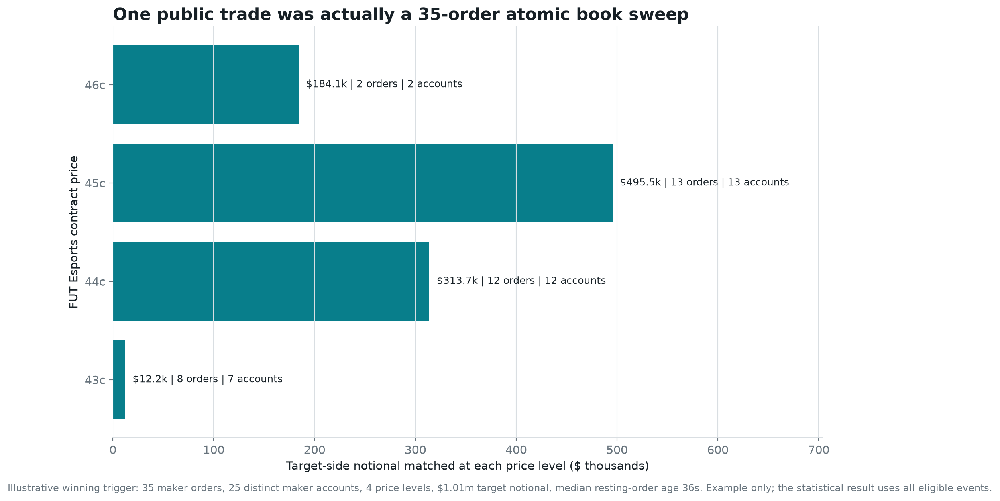
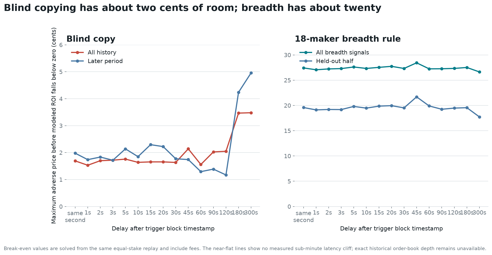
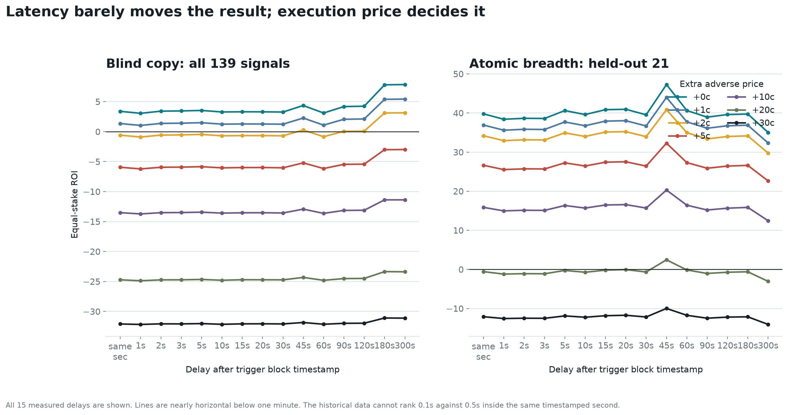
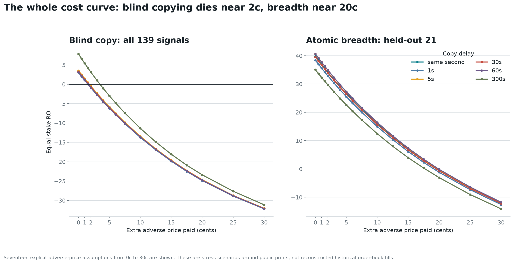
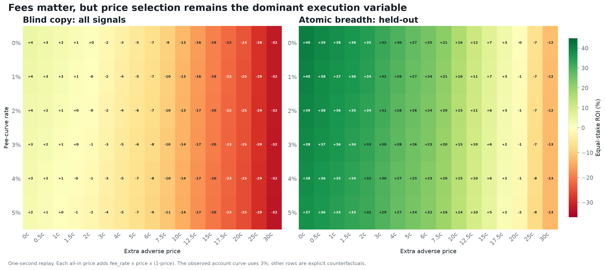
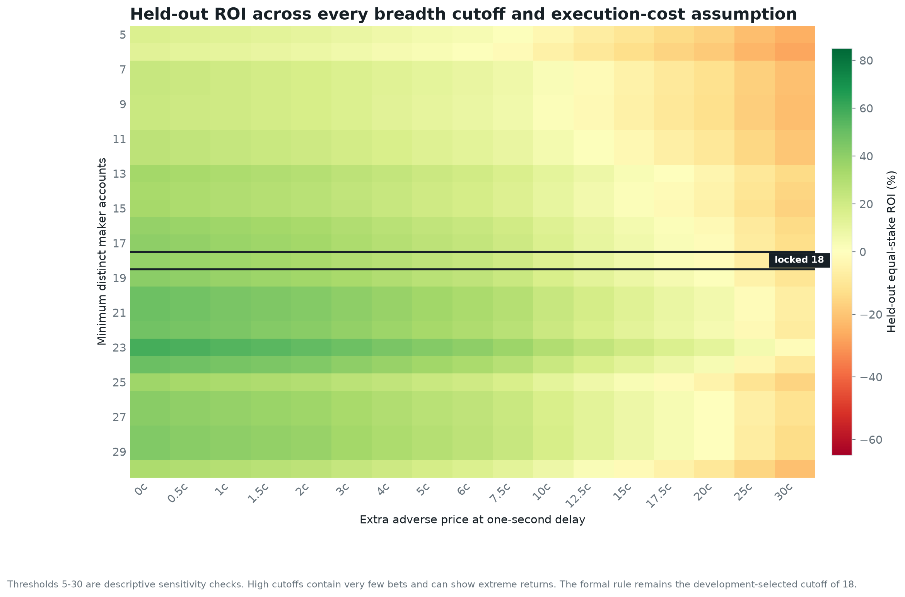
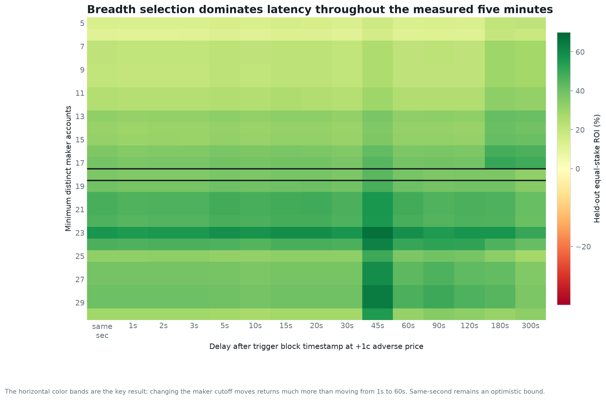
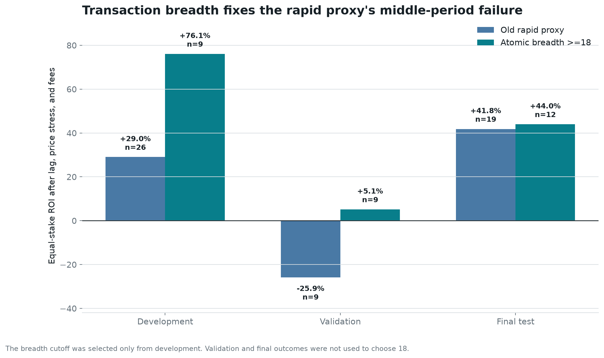

# Breakthrough Audit: Atomic Breadth

Generated 2026-08-25T18:47:53.344546+00:00. For the illustrated, nontechnical version, read [the plain-English essay](./plain_english_essay.pdf).

## Discovery

The strongest observable edge is not the wallet address, raw bet size, or copy speed. It is **atomic maker breadth**: one mined V2 `matchOrders` transaction consuming offers from at least 18 distinct signed maker accounts.

Blindly copying every canonical $25,000 signal lost $855.28 across 139 equal $100 bets (-6.15% ROI). The later period also lost -6.68%.

The breadth rule selected 30 bets, won 23, and returned +41.94% under the original 60-second plus five-cent stress. Triggers below 18 makers returned -11.56%.

| Rule | Bets | Wins | Price-implied wins | Calibration gap | ROI |
| --- | ---: | ---: | ---: | ---: | ---: |
| Below 18 makers | 50 | 29 | 29.30 | -0.6 pp | -11.56% |
| At least 18 makers | 30 | 23 | 16.04 | +23.2 pp | +41.94% |
| Held out after selection | 21 | 15 | 11.55 | +16.4 pp | +27.32% |


## What The Chain Proves

- All 149 trigger transactions were decoded from Polygon.
- The target was the BUY taker in all 149.
- The median trigger matched 19 maker orders from 14 distinct maker accounts.
- 66 triggers crossed more than one price level.
- The maximum on-chain notional reconciliation error was below one millionth of one percent.

Distinct signed accounts are not proven distinct humans. The fact is contract-level breadth, not human headcount.



## Realistic Copy Speed

The execution audit crosses 15 delays from same-second through 300 seconds with 17 adverse-price assumptions from zero through 30 cents. Historical timestamps are only one second precise, so 0.1-second and 0.5-second bots cannot be distinguished. Same-second is an optimistic bound because ordering inside that second is unknown. The clock starts at the mined block: maker breadth cannot be decoded at Polymarket's earlier off-chain MATCHED state from this public history.

At one second plus one cent, blind copying returned +1.04%. At one second plus two cents, it returned -0.90%. Its solved one-second break-even allowance is only 1.53 cents. The breadth rule's held-out allowance is 19.12 cents.

There is no measured sub-minute latency cliff. Price impact is the cliff: a fast bot still loses after paying away roughly two cents on indiscriminate copies.




## Full Parameter Atlas

The exported audit contains 1,444 grid cells across four sensitivity families:

- 510 latency-by-price results across blind and alpha-filtered copying;
- 102 fee-by-price settings for each strategy view;
- 442 breadth-cutoff-by-price settings;
- 390 breadth-cutoff-by-latency settings.

At one second plus one cent, the held-out breadth sample returned +35.60%. The dense atlas is a fragility map, not 1,444 independent confirmations.







## Alpha, Literally

The recoverable alpha is a conditional market-pricing residual:

```text
B(tx) = count(distinct makerOrders[].maker)
Signal(tx) = eligible first-event BUY taker transaction AND B(tx) >= 18
Probability alpha = realized outcome - public execution-proxy probability
```

Measured probability alpha was +23.21 pp across all 30 broad sweeps and +16.41 pp after development selection. Below 18 makers it was -0.59 pp. This identifies the public footprint of conviction, not the private information source.





## Falsification And Controls

| Test | Result | What it addresses |
| --- | ---: | --- |
| Development / validation / final ROI | +76.1% / +5.1% / +44.0% | Chronological stability |
| Held-out day-cluster ROI interval | +0.7% to +58.3% | Busy-day dependence |
| Threshold-selection market null | `p=0.046` | Repeats development cutoff search before held-out scoring |
| Discipline / price / period permutation | +28.0 pp, `p=0.0064` | Market-composition differences |
| Day-cluster broad minus narrow | +23.8 pp, interval +6.2 pp to +42.8 pp | Correlated events by day |
| Breadth odds after rapid flow, notional, and period controls | OR 4.94, `p=0.043` | Alternative observable explanations |
| Trigger notional in the same model | OR 0.94, `p=0.858` | Raw dollar size |



## Mechanism

The best interpretation is **informed liquidity demand**. The trader appears unusually informative when one taker decision clears offers from many maker accounts. Rapid final-minute buying was the first clue, but it lost 25.9% in middle validation and remains only a confidence tag.

The source of information is unknown. Public evidence cannot distinguish a superior model, faster public feeds, private information, coordinated research, or disciplined judgment. Maker breadth is the footprint of conviction, not the hidden information itself.

## Frozen Algorithm

1. Keep the first canonical event signal in core tennis, soccer, and esports.
2. Exclude map, single-game, BO1, and short-horizon contracts.
3. Require concentration of at least 70% and trigger price from 0.30 through 0.85.
4. Decode the mined V2 `matchOrders` call and verify the target is BUY taker for the signaled token.
5. Require at least 18 distinct `makerOrders[].maker` addresses.
6. Add no artificial delay. Snapshot the first live best ask and displayed depth after the mined call is decoded.
7. Create a $100 paper-only marketable FOK limit capped one cent above that ask and never above 0.90; record insufficient depth, rejection, partial fill, latency, and fees rather than assuming execution.
8. Hold accepted paper fills to resolution. Do not martingale or infer the whale's eventual size.

## Decision And Limits

Freeze `atomic-breadth-18` and collect at least 200 genuinely new eligible signals in paper mode. Do not deploy capital before the unseen sample remains profitable after costs and after removing its largest winners.

This is a two-month, retrospectively selected wallet and feature family. The threshold simulation corrects the declared maker-count search, not every research choice. The held-out half becomes negative after removing its five best winners. Public prints do not reconstruct historical order-book depth or publication latency. This is research, not financial advice.

## Evidence

- [Decoded trigger transactions](./trigger_transactions.json)
- [External tape, execution surface, and controls](./edge_analysis.json)
- [Signal-level feature table](./edge_features.csv)
- [Illustrated plain-English essay](./plain_english_essay.pdf)
- [Official Polymarket CTF Exchange V2](https://github.com/Polymarket/ctf-exchange-v2)
- [Official Polymarket order lifecycle](https://docs.polymarket.com/concepts/order-lifecycle)
- [Official public market WebSocket](https://docs.polymarket.com/api-reference/wss/market)
- [Dubach, The Anatomy of a Decentralized Prediction Market](https://arxiv.org/abs/2604.24366)
- [The Probability of Backtest Overfitting](https://www.davidhbailey.com/dhbpapers/backtest-prob.pdf)
