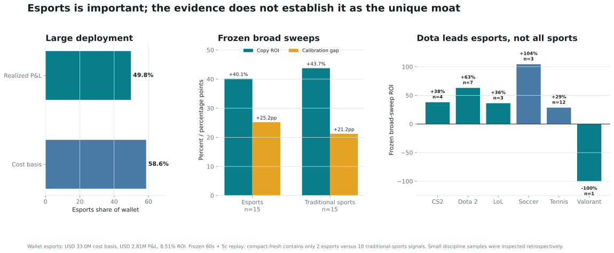
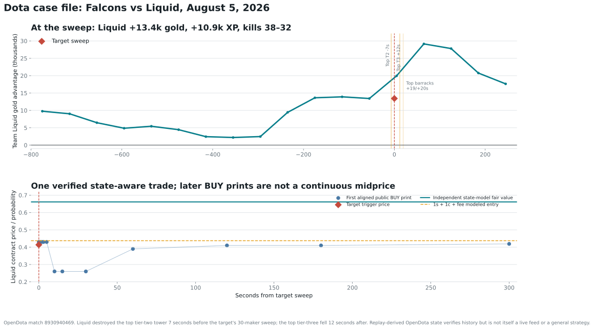
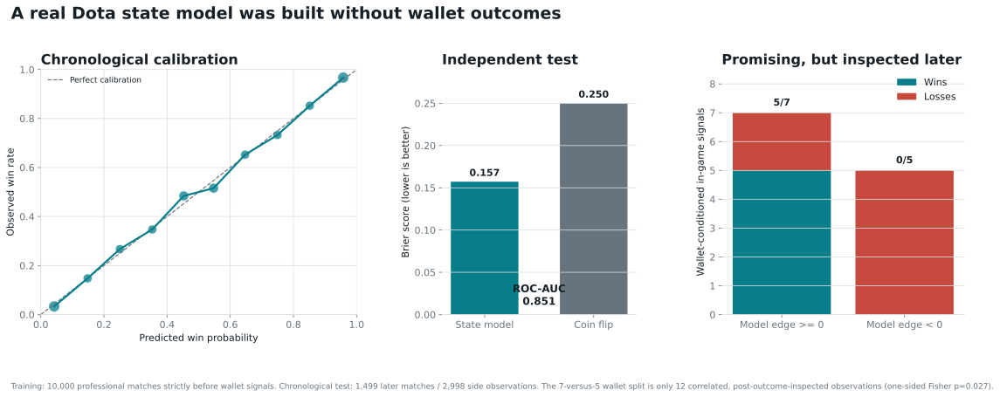
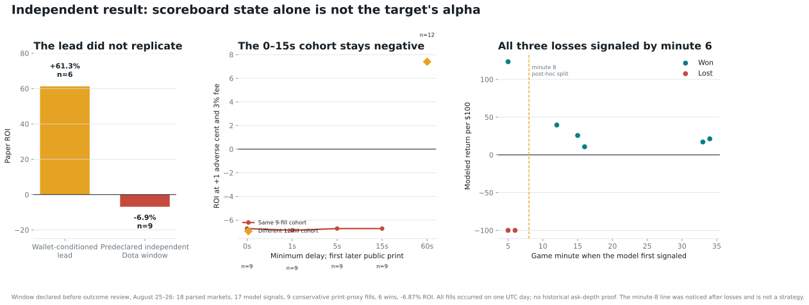
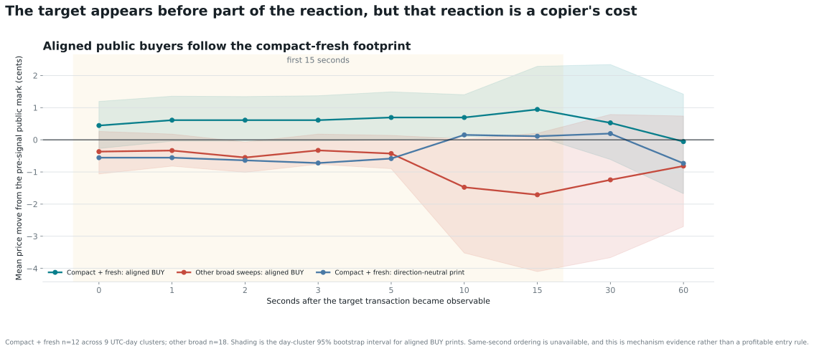
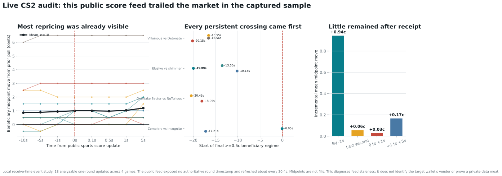
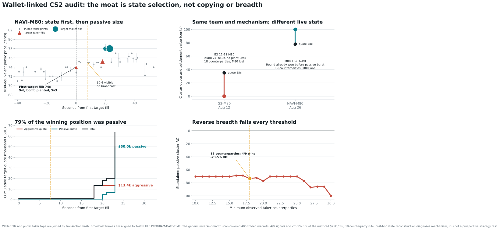
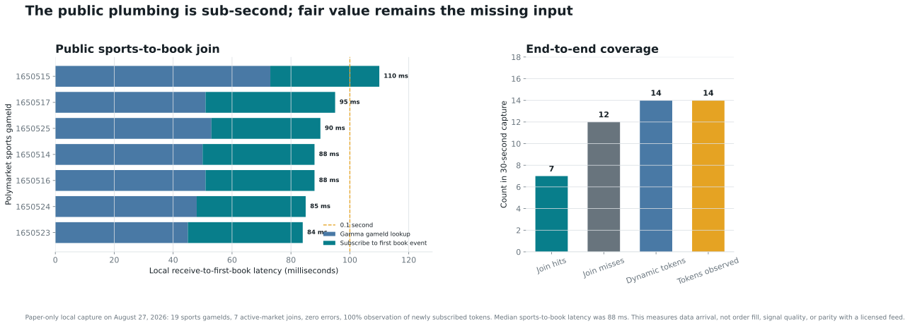
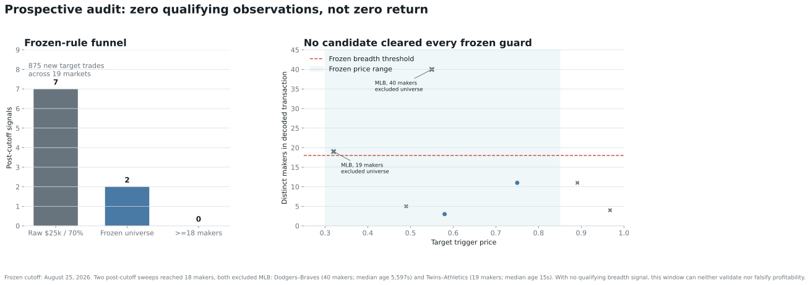

# Esports Edge Audit: What Was Verified, What Failed, What Remains

Generated from the committed wallet, OpenDota, market-tape, live-websocket, and frozen prospective artifacts. This report is paper research, not financial advice or a live-money authorization.

## Answer

Esports is a major wallet specialization, but it is **not verified as the unique moat**. Dota telemetry explains one high-conviction trade, and an independently trained state model predicts professional Dota outcomes well. The same model's market-wide trading rule nevertheless lost -6.87% in its first predeclared later window.

The wallet-linked CS2 reconstruction reveals a more concrete mechanism: **estimate live-state fair value, enter selectively, then choose aggressive or passive execution according to the book**. During M80-NAVI, the target bought before the displayed 10-6 round result while the public broadcast already showed a favorable 9-6, planted-bomb, 5-v-3 state; it then passively absorbed $50.0K at 78 cents. A same-team losing control and a -73.46% population result reject state-free imitation. The exact event-selection and fair-value model remain unrecovered.

## Is Esports The Moat?

| Evidence | Esports | Traditional sports |
| --- | ---: | ---: |
| Wallet cost basis | $33.01M (58.6% of wallet) | Remaining wallet |
| Wallet realized P&L | +$2.81M (49.8% of wallet) | Remaining wallet |
| Frozen broad-sweep bets | 15 | 15 |
| Wins | 12 | 11 |
| 60s + 5c replay ROI | +40.14% | +43.75% |
| Compact-fresh observations | 2 | 10 |

Dota is the strongest esports broad-sweep subgroup at 6/7 and +63.05%, but soccer and tennis contribute independently and samples are small.

## Verified Live-State Case

29 of 33 wallet Dota signals matched OpenDota professional series. Phase counts were 13 before map one, 12 in game, 4 between maps, and 4 unmatched.

The frozen broad Falcons-Liquid sweep occurred with Liquid +13,433 gold, +10,921 XP, and ahead 38-32 in kills. Liquid destroyed the top tier-two tower seven seconds before the target's 30-maker BUY; the top tier-three fell twelve seconds later. This verifies one state-aware transaction, not a general strategy.

## Independent State Model

The model used 10,000 professional matches strictly before wallet Dota signals. On 1,499 later matches / 2,998 side observations:

| Metric | Result |
| --- | ---: |
| ROC-AUC | 0.851 |
| Brier score | 0.157 |
| Coin-flip Brier | 0.250 |
| Log loss | 0.471 |

The wallet-conditioned five-point gate looked attractive: 5/6, +61.30%. It was only a post-outcome discovery lead with four day clusters; its day-cluster interval spans -42.8% to +109.0%.

## Independent Trading Falsification

The target-independent replay covered 18 later Dota child markets, generated 17 model signals, and obtained 9 conservative public-print proxy fills. Six won. At $100 each, P&L was -$61.87 and ROI was -6.87%.

The 0-15 second, +1 cent scenarios remained negative on the same nine-fill cohort. The 60-second row selected three extra fills, so its positive result is a cohort change rather than proof that waiting helps. All three primary losses first signaled in minutes five or six. A minute-eight gate would be post-hoc and is frozen only as a future shadow hypothesis.

## Timing And Public Reaction

Compact-fresh signals preceded aligned public BUY movement of 0.94 cents at 15 seconds, with day-cluster interval 0.11 to 2.28 cents. Same-second ordering is unavailable. This is mechanism evidence and a follower cost, not profit proof.

## Live CS2 Public-Feed Audit

The sports and market WebSockets were recorded under one local clock. The capture found 19 one-round CS2 transitions; 18 had a usable beneficiary book around the update. The public score observations were about 20.4 seconds apart.

11/18 analyzable beneficiary midpoints had already moved at least half a cent by one second before the changed score reached the process; 11/18 had moved by receipt. Mean movement was 0.944 cents at -1 second, with a four-game cluster interval of 0.444 to 1.444 cents. Incremental mean movement from receipt to +1 second was 0.028 cents, with a cluster interval of 0.000 to 0.079.

This verifies that the sampled public score feed was stale relative to the CLOB. It makes a faster upstream scoreboard or telemetry source a concrete missing-input hypothesis. The target wallet did not trade these specific games, the feed has no authoritative round timestamps, and the sample is tiny, so it does not identify the target's vendor or prove a private-feed moat.

## Wallet-Linked CS2 State And Execution Audit

### Winning case: NAVI vs M80

The target bought $63.4K of M80 in 29 fills over 23 seconds and realized +$18.4K before rebates. At its first fill, the timestamp-aligned public broadcast showed M80 leading 9-6 in round 16, with the bomb planted and five M80 players alive against three NAVI players. The target paid 74 cents. The broadcast first displayed the 10-6 round win about 7.5 seconds later. This is evidence of a state-aware decision before the displayed result, not advance knowledge: the favorable state was already visible.

Execution then changed from taking to making. 78.9% of the full market's quote notional was passive. In the three-second cluster after the round, 19 public taker wallets bought the opposite NAVI outcome against 27 exact target maker fills. The target obtained $50.0K of M80 at a 78-cent VWAP. A copier cannot reproduce this simply by reading the target transaction faster: it needs the same fair value, an earlier resting quote, queue position, and incoming opposite-side flow.

### Losing controls

The same target, team, and passive shape can fail. Against G2, it bought $83.2K of M80, 84.5% passively. The key $50.3K cluster at 35 cents filled against 18 counterparties. The aligned broadcast showed G2 12-11 M80, 19 seconds left, no bomb planted, and 3-v-3. M80 lost the round and match; the target lost $83.6K on the market.

The target also bought $18.8K of 1WIN Map 2 exposure, mostly aggressively. Technical problems ended the map at Nemesis 7-12 1WIN, but the committed Polymarket rule resolved an unfinished Map 2 at 50-50. The target sold near 50 cents and realized -$1.2K. This rejects an always-correct late-CS2 story and shows that resolution-rule risk belongs in the model.

### Population falsification

The reverse-breadth rule was fixed at a maximum five-second cluster, at least $25.0K, at least 18 target maker fills, and at least 18 unique public taker counterparties. Across 405 merged wallet markets, all 11 local candidates had complete public-tape joins. Nine passed. Four won; P&L was -$813.4K on $1.11M, or -73.46%. Every counterparty cutoff from 10 through 30 was negative. Counter-Strike alone was 1/2 at -36.10%.

**Inference bounded by the evidence:** the best current mechanism hypothesis is a low-latency match-state probability model, filtered by team/event context, with selective aggressive entry and passive quoting. State, execution role, and counterparties are verified in the cases. The exact fair-value model, data vendor, and a profitable prospective strategy are not.

## Live Paper Infrastructure

A 30-second capture joined Polymarket sports gameId messages through Gamma to dynamically subscribed CLOB token books. It queried 19 game IDs, found 7 active markets, added 14 tokens, observed all 14, and had zero join errors. Median local sports-to-book time was 88 ms; the range was 84-110 ms.

This verifies sub-second public plumbing. It does not supply fair value, prove queue position, or prove a fill. The engine is hardcoded PAPER_ONLY and contains no signing or submission path.

## Frozen Prospective Audit

The refreshed wallet window contained 875 post-cutoff trades, 7 raw threshold signals, 2 frozen-universe signals, and **zero** frozen 18-maker signals. Two raw broad sweeps were observed, both in excluded MLB: Los Angeles Dodgers vs. Atlanta Braves (40 makers, 5,597.3s median maker age); Minnesota Twins vs. Athletics (19 makers, 15.0s median maker age). The newer 19-maker sweep is compact and fresh but unresolved and outside the rule.

Zero eligible signals means no return observation. It neither validates nor falsifies the breadth strategy.

## Literal Alpha Boundary

~~~text
Observed wallet result
= unrecovered event / side selection
+ partly reproducible live-state information
+ observable atomic execution
- follower delay, price reaction, fees, and finite depth
~~~

Recovered: state scoring, public live-data joins, exact paper FOK depth walking, the wallet's taker maker-breadth footprint, evidence that the sampled public CS2 score feed trailed CLOB repricing, and a wallet-linked CS2 sequence showing aggressive entry from favorable live state followed by large passive deployment.

Rejected: generic Dota scoreboard value, passive reverse breadth, team loyalty, and blind copying speed. The same-team G2 control and 1WIN rule-sensitive loss show that the target is not always correct in late CS2 states.

Not recovered: a profitable rule for choosing the team, match, and state. Team/player priors, roster, map and economy state, series context, event quality, and licensed telemetry remain hypotheses until independently timestamped, frozen, and tested prospectively.

## Decision

Keep all prototypes paper-only. Continue the unchanged target-taker atomic-breadth rule, but reject passive reverse breadth as a strategy. Build a CS2 shadow market maker from independently timestamped round, economy, roster, map, and series features. Require positive multi-day prospective P&L with explicit queue, fill, cancel, adverse-selection, and resolution-rule modeling before considering capital.

## Primary Sources

- [Official Polymarket sports WebSocket](https://docs.polymarket.com/api-reference/wss/sports)
- [Official Polymarket market WebSocket](https://docs.polymarket.com/api-reference/wss/market)
- [Official Polymarket order lifecycle](https://docs.polymarket.com/concepts/order-lifecycle)
- [OpenDota parser](https://github.com/odota/core)
- [OpenDota professional match index](https://api.opendota.com/api/proMatches)
- [Official BLAST NAVI-M80 match](https://blast.tv/cs/tournaments/open-2026-season-2/match/4da07aca/navi-m80)
- [HLTV NAVI-M80 match](https://www.hltv.org/matches/2396925/natus-vincere-vs-m80-blast-open-porto-2026) and [broadcast VOD](https://www.twitch.tv/videos/2856775537)
- [HLTV G2-M80 control](https://www.hltv.org/matches/2396561/g2-vs-m80-esports-world-cup-2026) and [broadcast VOD](https://www.twitch.tv/videos/2844017976)
- [HLTV Nemesis-1WIN forfeit record](https://www.hltv.org/matches/2397043/nemesis-vs-1win-gluck-moscow-cyber-games-2026-closed-qualifier)
