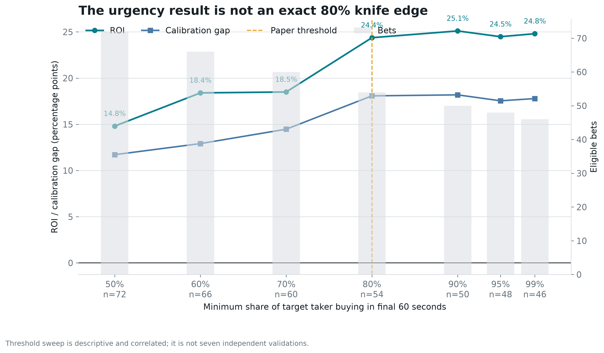
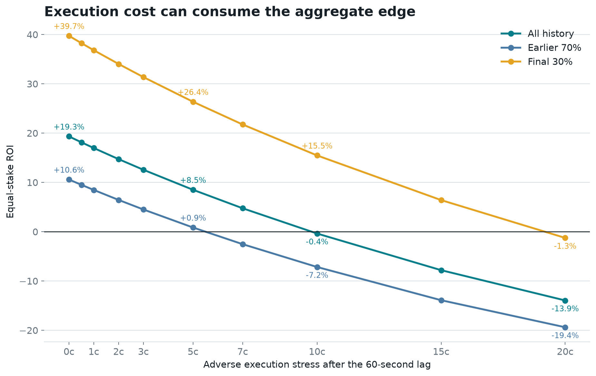

# Replication Prototype: External-Tape Backtest

Generated 2026-08-25T16:10:47.000Z. This implementation is paper-only and contains no signing or order-submission path.

## What Changed

The earlier prototype used the target's next future BUY as an execution proxy. That leaked the target's later behavior into fill selection and could not answer whether an unrelated follower had a tradable price. The replacement uses market-wide public taker prints and never consults a later target fill to decide execution.

| Component | Locked behavior |
| --- | --- |
| Signal | Exact target taker BUY flow crosses $25.0K at >=70.0% directional concentration |
| Urgency guard | At least 80.0% of observed target taker BUY notional arrived in the final 60 seconds |
| Eligibility | Allowed disciplines, price 0.30-0.85, no single-map/BO1 or short-horizon market |
| Event control | First eligible condition per canonical event |
| Delay | 60 seconds after the signal |
| Historical price | First direction-neutral public taker print in the next 60 seconds; trigger fallback if absent |
| Cost stress | 5 cents adverse movement plus the account-observed 3% fee curve |
| Live paper execution | Marketable limit at the current ask, FOK, rejected above trigger + 0.05 or when displayed ask depth is insufficient |
| Sizing | Fixed bankroll fraction; no attempt to predict the target's final position |
| Model gate | Predicted win probability minus all-in price must exceed 5.0% |

The BO1 exclusion is important. The corrected audit records a $1.78M loss across 9 BO1 markets rather than hiding them inside the profitable series bucket.

Because that correction was found after inspecting final losses, the audit also preserves the original-classifier counterfactual. Keeping BO1 eligible returns +5.27% over 84 events and +14.09% over 28 events after the same fixed boundary. Its later ROI after removing the top three winners is -2.01%.

## Blind-Copy Baseline

The literal copy strategy is rejected before model selection. Copying every first canonical-event signal produces 139 bets, -$855.28 P&L, -6.15% ROI, and a $2.1K maximum drawdown at $100 per signal. It remains negative after the fixed split: 45 bets, -$300.49, -6.68% ROI. Removing its best five winners worsens all-period ROI to -13.52%.

This matters because the 80-event primary test below is already a restricted universe. Its positive result must not be described as the return from blindly following the account.

## Primary Historical Test

This test includes all 80 eligible events. It does not discard signals lacking a convenient future print: 3 use the trigger-price fallback. Public-print coverage is 96.25%.

| Period | Bets | Wins | P&L ($100 per bet) | ROI | Max drawdown |
| --- | ---: | ---: | ---: | ---: | ---: |
| Earlier 70% | 56 | 35 | +$47.71 | +0.85% | $786.07 |
| Chronological final 30% | 24 | 17 | +$632.59 | +26.36% | $200.00 |
| All | 80 | 52 | +$680.30 | +8.50% | $826.11 |

The final-period IID bootstrap interval is -10.2% to +61.4%. Clustering by trading day widens it to -15.9% to +55.8% across 9 days. Both cross zero.

The side falsification is harder to dismiss: target direction returned +26.36%, the opposite direction -46.03%, and randomized sides had a -9.87% median (one-sided `p=0.0301`). That supports directional information in this period; it does not remove wallet-selection bias.

## Universe Attribution

Blindly copying every canonical seed signal loses money. The nested ladder shows which observable guards change that result, using the same fixed 2026-08-11T00:21:37+00:00 boundary for every row:

| Nested rule | All bets | All ROI | Bets after split | ROI after split |
| --- | ---: | ---: | ---: | ---: |
| All canonical $25K signals | 139 | -6.15% | 45 | -6.68% |
| Add rapid 60-second burst | 96 | +3.42% | 33 | +6.36% |
| Add map/short-market exclusion | 91 | +7.33% | 28 | +19.57% |
| Add core disciplines | 63 | +17.69% | 21 | +33.32% |
| Add 0.30-0.85 price guard | 54 | +24.37% | 19 | +41.82% |

Urgency is the first rule that flips the sign; market format adds the largest structural improvement. Discipline and price increase ROI further but were informed by this investigated sample, so the ladder is attribution rather than five independent strategy trials.

## Mechanism Audit

The candidate mechanism is **conviction compression**: most target taker buying arrives in one minute, but the next unrelated execution proxy still understates how often that side wins. Rapid signals record 41 wins against 31.24 implied (+18.1 pp); slower signals record 11 against 14.09 implied (-11.9 pp).

The day-clustered rapid-minus-slow calibration interval is +10.1 pp to +51.4 pp around a +30.0 pp estimate. Broad discipline/price stratification leaves 3.36x common win odds (`p=0.023`). The stronger falsification is less favorable: permuting urgency labels within discipline, three price bands, and chronological period reduces the effect to +9.6 pp across 52 comparable bets, with one-sided `p=0.239`. That non-result is why the mechanism remains provisional.

Thresholds from 50% through 99% remain positive, so 80% is not a single lucky cut. They reuse overlapping bets, however, and do not count as independent confirmations.

## Execution Stress

### Slippage at a 60-second delay

| Adverse stress | Earlier 70% | Final 30% | All |
| --- | ---: | ---: | ---: |
| 0c | +10.58% | +39.73% | +19.33% |
| 0.5c | +9.51% | +38.26% | +18.14% |
| 1c | +8.47% | +36.82% | +16.97% |
| 2c | +6.45% | +34.03% | +14.72% |
| 3c | +4.51% | +31.36% | +12.56% |
| 5c | +0.85% | +26.36% | +8.50% |
| 7c | -2.53% | +21.75% | +4.75% |
| 10c | -7.16% | +15.47% | -0.37% |
| 15c | -13.90% | +6.41% | -7.80% |
| 20c | -19.38% | -1.26% | -13.94% |

### Delay at five-cent stress

| Delay | Print coverage | Earlier 70% | Final 30% | All |
| --- | ---: | ---: | ---: | ---: |
| 0s | 98.8% | +1.07% | +27.25% | +8.92% |
| 1s | 98.8% | +0.74% | +26.41% | +8.44% |
| 2s | 98.8% | +0.98% | +26.72% | +8.70% |
| 5s | 97.5% | +0.98% | +28.06% | +9.11% |
| 10s | 97.5% | +0.89% | +27.26% | +8.80% |
| 15s | 96.3% | +0.68% | +28.60% | +9.06% |
| 30s | 95.0% | +0.97% | +26.82% | +8.72% |
| 60s | 96.3% | +0.85% | +26.36% | +8.50% |
| 120s | 92.5% | +1.14% | +26.61% | +8.78% |
| 300s | 98.8% | +3.78% | +35.59% | +13.32% |

The public market usually did not reprice immediately: median target-direction markout is 0.0000 after 60 seconds and 0.0000 after five minutes. This gives a follower time in the observed tape, but a print proves neither available ask depth nor a fill for our order size.

The lag rows reuse the same outcomes and are sensitivity checks, not five independent trials. The 300-second row must not be selected retrospectively as an "optimal" delay.

## Leakage And Selection Audit

Requiring a future same-direction print looked reasonable but was outcome-dependent. 8 signals had no aligned print and only 3 won; 3 had no print at all and none won. Excluding them mechanically inflated ROI. The primary test therefore uses direction-neutral prints and a forced fallback.

A second guard tested twelve simple refinements on a 50/20/30 split. The selected `fresh-signal` gate returned +36.5% in development, -23.9% in validation, then +29.1% in the final slice. That reversal is a direct warning against narrating one attractive subgroup as a law.

## Walk-Forward Filter

The deployable feature set is observable at signal time: trigger price, concentration, trigger-fill share, 60-second taker-burst share, prior maker share, signal age, five-minute public momentum and flow, pregame status, deposit lag, discipline and market type. For each prediction, training includes only earlier markets whose Gamma `closedTime` had passed. Coverage is 100.0%; the ambiguous closed-position timestamp is not used for label availability.

| Walk-forward measure | Result |
| --- | ---: |
| Warmup / predictions | 40 / 40 |
| ROC-AUC | 0.635 |
| Selected | 15 bets, 10 wins |
| Selected ROI | +27.54% |
| Same-period burst-only ROI | +20.05% on 28 bets |
| Same-period always-copy ROI | +5.40% |
| Day-cluster 95% interval | -13.3% to +69.4% |
| ROI after removing top 3 / top 5 winners | -0.7% / -22.1% |
| Positive C/threshold sensitivity cells | 20 / 20 |

| Feature ablation | Walk-forward ROC-AUC |
| --- | ---: |
| Full observable feature set | 0.635 |
| Remove 60-second target burst | 0.547 |
| Remove public-tape momentum and flow | 0.576 |
| Price and category only | 0.464 |

The transparent burst gate improves the same-period baseline before modeling. The model raises ROI from +20.05% to +27.54%, but model ROI turns -0.7% after removing its top three winners versus +4.7% for the burst gate. The model is therefore secondary to the mandatory burst guard.

The model is not using unresolved labels, but 15 bets are too few for deployment. The model family and features were designed during this investigation, so this is pseudo-out-of-sample evidence rather than a locked prospective trial. Its fit on all historical rows is used only to score forward paper signals; that in-sample fit is not counted as evidence.

## Paper Monitor

The monitor reconstructs target taker flow, enriches surviving candidates with the current book and the same one-hour market-wide tape window used in training, checks displayed ask depth, scores the frozen model, and emits a MARKETABLE_LIMIT_FOK paper intent only when price, depth, and edge guards pass. Current saved-data run: 0 intents from 0 pre-book candidates, with $0.00 proposed exposure. Zero is expected because the fixed snapshot contains no fresh signal.

| Risk control | Default |
| --- | ---: |
| Mode | `PAPER_ONLY` |
| Paper bankroll | $10.0K |
| Per-order cap | min($100.00, 0.5% of bankroll) |
| Per-event cap | 1.0% of bankroll |
| Portfolio cap | 5.0% of bankroll |
| Maximum adverse move | 0.05 |
| Time in force | FOK; intent expires after 30 seconds |

Before considering capital, the locked model needs a forward paper sample with stored order-book snapshots, observed FOK outcomes, depth slippage, and at least 200 eligible signals. The current code intentionally cannot trade.

## Reproduce

- `npm run research:tape` collects [market_tape.json](./market_tape.json).
- `npm run research:edge` builds [edge_analysis.json](./edge_analysis.json), [edge_features.csv](./edge_features.csv), and [edge_model.json](./edge_model.json).
- `npm run research:graphics` rebuilds every PNG/SVG in [figures](./figures/).
- `npm run research:replicate` rebuilds [replication_intents.json](./replication_intents.json), [replicator_config.json](./replicator_config.json), and [replication_backtest.json](./replication_backtest.json).
- Historical audit contains 80 forced simulations.

## Limits

- Public prints do not reconstruct historical ask depth or queue priority.
- Five cents is a stress assumption, not a guaranteed executable price.
- The wallet was selected after exceptional performance; standard intervals do not correct that selection.
- Outcomes and trading days remain dependent, and the sample covers roughly two months.
- The broad calibration result weakens under the tightest discipline/price/time composition control.
- This is research software, not financial advice.
