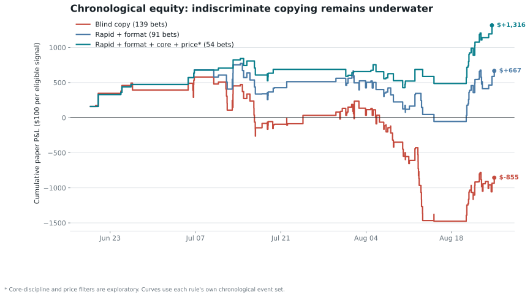

# @djdjdjekekek: Investigation And Replication Research

## Result

The account is a two-layer automated operation: 92.8% of fills are maker executions, while 72.1% of quote notional is aggressive taker flow. The deeper discovery is narrower: **the directional signal concentrates in mined taker transactions that consume offers from at least 18 distinct signed maker accounts.**

| Evidence | Result |
| --- | ---: |
| Confirmed economic result | $5.91M extracted above deposits |
| High-taker market subset | +23.76% ROI; clustered interval +1.3% to +44.7% |
| True multi-map series | 114 markets, +$7.57M, +31.20% ROI |
| Single game/map including BO1 | 81 markets, -$4.89M, -57.55% ROI |
| Forced external-tape backtest | 80 bets, +8.50% all-period ROI |
| Blind all-signal external-tape copy | 139 bets, -$855.28, -6.15% all / -6.68% later |
| Atomic breadth at least 18 | 30 bets, 23 wins, +41.94% ROI |
| Breadth after development selection | 21 bets, 15 wins, +27.32% ROI |
| Compact-fresh breadth held out | 7 bets, 6 wins, +63.17% ROI; cluster interval -8.7% to +110.4% |
| Current +1c FOK coverage | 94.7% at $100; 46.1% at $10,000 |
| Broad pregame closing-line value | Median -0.67c; 4/12 positive |
| Esports wallet deployment | $33.01M cost basis; +$2.81M; +8.51% ROI |
| Dota state model / independent trade test | ROC-AUC 0.851 on 1,499 later matches; -6.87% across 9 market-wide paper fills |
| Frozen prospective breadth window | 0 qualifying signals from 875 new trades; no ROI observation |
| Live public sports-to-book probe | 7 active joins, 14/14 new tokens observed, 88 ms median local latency |
| Live CS2 public-feed event study | 11/18 beneficiary books already moved by -1s; 0.03c mean incremental move from receipt to +1s |
| Wallet-linked CS2 state case | M80 9-6, planted bomb, 5-v-3 at first fill; $50.0K then filled passively at 78c |
| Passive reverse-breadth falsification | 4/9 wins, -$813.4K, -73.46% ROI; every 10-30 counterparty cutoff negative |
| Breadth composition control | +28.0 pp across 63 comparable bets; one-sided `p=0.0064` |
| Original-classifier BO1 counterfactual | 84 bets, +5.27% all / +14.09% later |
| Chronological final period | 24 bets, +26.36% ROI; day-cluster interval -15.9% to +55.8% |
| Expanding-window model | 15 selected bets, +27.54% ROI; ROC-AUC 0.635 |

## Corrections And Rejections

The original classifier treated BO1 as a series. Correcting it moves 9 markets that lost $1.78M into the single-map failure bucket. This correction was found while inspecting final losses and is explicitly not claimed as an untouched discovery.

The external backtest also fixes a more serious execution leak: it no longer uses the target's next future fill as the follower's price. It uses 143,507 unrelated market-wide prints, forces no-print signals into the test, and crosses 15 delays from same-second to five minutes with 17 adverse-price assumptions from zero to 30 cents. The clock starts when settlement is mined because maker breadth is not available at the earlier off-chain MATCHED state. One-second blind copying breaks even after only 1.53 cents.

No stable leader wallet was identified. Early-selected peer confirmation returned +7.62% on later bets, below the +29.67% return without confirmation. Eventual target size was also unpredictable. Neither peer identity nor inferred final size belongs in the model.

## Onchain Attribution

The type-3 Deposit Wallet resolves to controller EOA `0xC332040b7ed35DeB84488bEEa049d8d34934141b`. That owner directly transacted with the EIP-7702 account responsible for $29.56M of funding. This establishes address control, not a natural-person identity. High-volume routers remain labeled as shared infrastructure.

## Read In Order

1. [Illustrated plain-English essay](./plain_english_essay.pdf): literal alpha boundary, esports telemetry, wallet-linked state reconstruction, independent falsification, 6,244 execution-and-capacity scenarios, and 40 charts without requiring code.
2. [Esports edge audit](./esports_edge_report.md): CS2 state cases, passive-rule falsification, Dota state model, failed market-wide replay, and exact remaining hypotheses.
3. [Breakthrough audit](./breakthrough_report.md): atomic-breadth signal, falsification tests, and promotion criteria.
4. [Replication report](./replication_report.md): the earlier monitor and its exact execution assumptions.
5. [Deep trader report](./trader_report.md): fill reconstruction, timing, case studies and statistical attribution.
6. [Onchain report](./onchain_report.md): controller proof, funding graph and cash reconciliation.

## Bottom Line

The strongest observable target-taker footprint remains dense, fresh liquidity consumption. The wallet-linked CS2 case adds a second mechanism: state-aware aggressive entry followed by passive deployment at a chosen fair-value boundary. But generic Dota state lost -6.87%, passive reverse breadth lost -73.46%, and the same-team G2 control lost. The missing layer is the target's event/context selection and fair-value model, potentially using faster telemetry. Broad pregame CLV is negative, the prospective breadth evidence remains sparse, and size reduces FOK coverage. The repository therefore remains paper-only.
