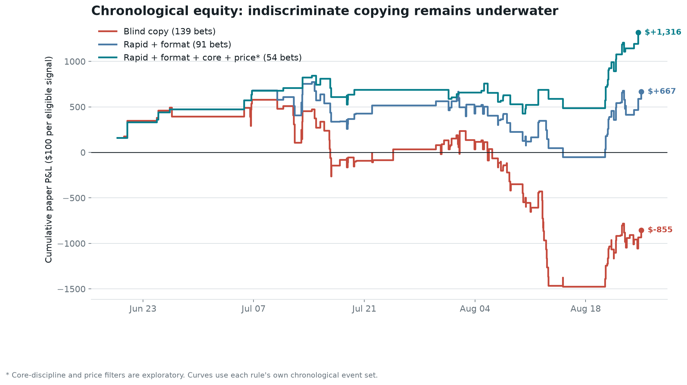

# @djdjdjekekek: Investigation And Replication Research

## Result

The account is a two-layer automated operation: 92.8% of fills are maker executions, while 72.1% of quote notional is aggressive taker flow. The deeper discovery is narrower: **rapid target taker sweeps in full-match or multi-map markets contain a delayed, execution-sensitive directional signal.**

| Evidence | Result |
| --- | ---: |
| Confirmed economic result | $5.91M extracted above deposits |
| High-taker market subset | +23.76% ROI; clustered interval +1.3% to +44.7% |
| True multi-map series | 114 markets, +$7.57M, +31.20% ROI |
| Single game/map including BO1 | 81 markets, -$4.89M, -57.55% ROI |
| Forced external-tape backtest | 80 bets, +8.50% all-period ROI |
| Blind all-signal external-tape copy | 139 bets, -$855.28, -6.15% all / -6.68% later |
| Rapid-signal calibration | 41 wins vs 31.24 implied; +18.1 pp |
| Tight composition control | +9.6 pp across 52 comparable bets; one-sided `p=0.239` |
| Original-classifier BO1 counterfactual | 84 bets, +5.27% all / +14.09% later |
| Chronological final period | 24 bets, +26.36% ROI; day-cluster interval -15.9% to +55.8% |
| Expanding-window model | 15 selected bets, +27.54% ROI; ROC-AUC 0.635 |

## Corrections And Rejections

The original classifier treated BO1 as a series. Correcting it moves 9 markets that lost $1.78M into the single-map failure bucket. This correction was found while inspecting final losses and is explicitly not claimed as an untouched discovery.

The external backtest also fixes a more serious execution leak: it no longer uses the target's next future fill as the follower's price. It uses 143,507 unrelated market-wide prints, forces no-print signals into the test, adds five cents adverse slippage, applies fees, and permits only one condition per event.

No stable leader wallet was identified. Early-selected peer confirmation returned +7.62% on later bets, below the +29.67% return without confirmation. Eventual target size was also unpredictable. Neither peer identity nor inferred final size belongs in the model.

## Onchain Attribution

The type-3 Deposit Wallet resolves to controller EOA `0xC332040b7ed35DeB84488bEEa049d8d34934141b`. That owner directly transacted with the EIP-7702 account responsible for $29.56M of funding. This establishes address control, not a natural-person identity. High-volume routers remain labeled as shared infrastructure.

## Read In Order

1. [Breakthrough audit](./breakthrough_report.md): the new signal, falsification tests, failed hypotheses and promotion criteria.
2. [Replication report](./replication_report.md): exact execution assumptions, sensitivity and paper-monitor behavior.
3. [Deep trader report](./trader_report.md): fill reconstruction, timing, case studies and statistical attribution.
4. [Onchain report](./onchain_report.md): controller proof, funding graph and cash reconciliation.

## Bottom Line

This is a credible paper-trading candidate, not a cracked money machine. Direction beats randomized and opposite sides, urgency separates realized wins from public implied probabilities, and the walk-forward filter improves its baseline. Yet the tightest composition control is not significant, both ROI confidence intervals still cross zero, performance is concentrated, and public prints do not prove executable depth. The repository therefore freezes the model and emits paper-only FOK intents.
