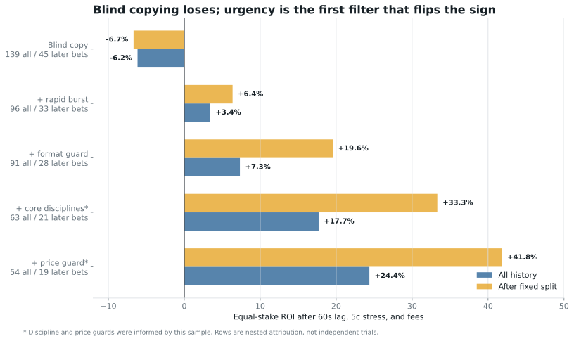
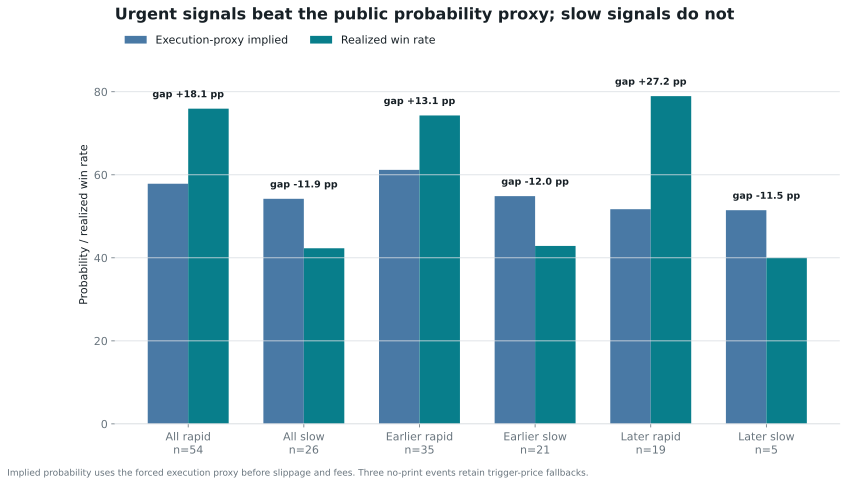
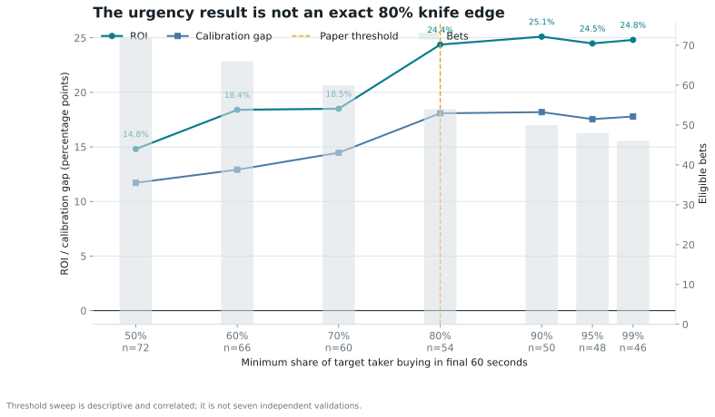

# Deep Trader Report: @djdjdjekekek

Generated 2026-08-25T15:29:24.006Z. Coverage: 2026-06-19T18:37:08Z through 2026-08-25T05:52:45Z.

## Executive Finding

The candidate edge is **selective directional information expressed through compressed aggressive taker flow**, surrounded by an automated maker/inventory layer. Counting fills hid this: makers are 92.8% of fills but only 27.9% of dollars. Taker fills are just 7.2% of count yet carry 72.1% of quote notional.

The strongest split is not sport versus esports. It is **aggressive versus passive capital**:

| Market subset | Markets | Cost | PnL | ROI | Event-cluster 95% ROI interval |
| --- | ---: | ---: | ---: | ---: | ---: |
| Taker share >= 50% | 241 | $42.20M | +$10.03M | +23.76% | +1.3% to +44.7% |
| Taker share < 50% | 144 | $14.01M | -$4.37M | -31.21% | -61.7% to +0.1% |

In a robust logistic model controlling for average entry price, log position size, timing, discipline, market type and concentration, a 10-point increase in taker share multiplies the odds of the dominant outcome winning by about 1.26 (full-range coefficient `p=1.99e-8`). This is descriptive, not causal, but it survives controls that the original report omitted.

## Second-Pass Discovery

The first pass contained a consequential semantic bug: titles marked `(BO1)` were classified as series winners even though a best-of-one is a single map. Correcting that label exposes a much sharper boundary:

| Format | Markets | Cost | PnL | ROI |
| --- | ---: | ---: | ---: | ---: |
| BO1 alone | 9 | $2.62M | -$1.78M | -67.80% |
| True multi-map series | 114 | $24.26M | +$7.57M | +31.20% |
| Single game/map, including BO1 | 81 | $8.49M | -$4.89M | -57.55% |

This is a domain correction consistent with the pre-existing map exclusion, but it was noticed while inspecting final-period losses. It is disclosed as such, not presented as a pristine holdout discovery.

The sign does not depend on that correction. A counterfactual that leaves BO1 eligible as the original classifier did returns +5.27% over 84 events and +14.09% over 28 events after the same fixed split. The corrected rule is economically better; the counterfactual checks that the positive sign was not manufactured by relabeling BO1.

## What Blind Copying Would Have Done

A follower who copied every first canonical-event signal after the target crossed $25,000 would have placed 139 equal $100 bets, staked $13.9K, and lost $855.28. That is -6.15% ROI with a $2.1K maximum drawdown. The result did not repair itself later: the 45 signals after the fixed split lost $300.49 at -6.68% ROI.

Blind copying also produced only 80 wins versus 77.15 implied by the execution proxy. Its +2.0 pp calibration gap is ordinary (Poisson-binomial upper-tail `p=0.333`). That diagnostic assumes independent outcomes and calibrated proxy probabilities; it is not a causal p-value. The large-wager observation alone therefore contains no demonstrated follower edge.

The deeper test replaces the target's later fills with 143,507 unrelated public taker prints from 149 signal markets. Every eligible event is forced into the simulation: after a 60-second lag, execution uses the first direction-neutral public print in the next minute, falls back to the trigger price when none exists, adds five cents adverse slippage, and applies the account-observed 3% fee curve.

| External-tape test | Bets | Wins | ROI |
| --- | ---: | ---: | ---: |
| Earlier 70% | 56 | 35 | +0.85% |
| Chronological final 30% | 24 | 17 | +26.36% |
| All eligible events | 80 | 52 | +8.50% |

The final-period result beats an opposite-side return of -46.03% and a random-side median of -9.87% (one-sided randomization `p=0.0301`). It is still not statistically settled: the day-clustered 95% interval is -15.9% to +55.8% across only 9 days.

The mechanism is a **rapid taker sweep**, not eventual wallet size. Signals with most taker notional arriving in the final 60 seconds returned +24.37% versus -24.46% without that burst. Meanwhile, initial trigger size predicts eventual cost poorly: chronological log-cost `R^2=-0.108`, with $577.5K mean absolute error. A follower can observe urgency; it cannot reliably infer the target's final stake.

That burst split has the same sign on both sides of the chronological boundary: +14.9% versus -22.6% earlier, and +41.8% versus -32.4% in the final period. The full-sample win-rate Fisher test gives `p=0.0054`, but that is a descriptive post-discovery test without feature-search correction.

## Sharpened Mechanism: Conviction Compression

The strongest new diagnostic compares realized wins with the probability visible at the forced execution proxy. Rapid signals won 41 times; their prices implied only 31.24 wins. That is 9.76 excess wins and a +18.1 pp calibration gap. Slower signals produced 11 wins versus 14.09 implied, a -11.9 pp gap in the opposite direction.

| Period and urgency | Bets | Actual wins | Proxy-implied wins | Calibration gap | ROI |
| --- | ---: | ---: | ---: | ---: | ---: |
| All rapid | 54 | 41 | 31.24 | +18.1 pp | +24.37% |
| All slower | 26 | 11 | 14.09 | -11.9 pp | -24.46% |
| Earlier rapid | 35 | 26 | 21.41 | +13.1 pp | +14.90% |
| Earlier slower | 21 | 9 | 11.52 | -12.0 pp | -22.56% |
| Later rapid | 19 | 15 | 9.83 | +27.2 pp | +41.82% |
| Later slower | 5 | 2 | 2.57 | -11.5 pp | -32.40% |

The raw gap is not only an in-play artifact. Rapid signals returned +24.65% over 23 pregame bets and +24.17% over 31 in-play bets. It is also not exactly one giant transaction: all 47 one-shot signals are mechanically rapid at the threshold timestamp, but 7 rapid multi-fill signals also exist. Those seven all won, which is suggestive but far too small to estimate separately.

Uncertainty cuts both ways. A day-cluster bootstrap estimates the rapid-minus-slow calibration gap at +30.0 pp, with a +10.1 pp to +51.4 pp interval. A broad Cochran-Mantel-Haenszel control by discipline and price band gives 3.36x common win odds (95% CI 1.20-9.45, `p=0.023`). But a tighter permutation within discipline, three price bands, and chronological period retains only 52 comparable bets; its effect shrinks to +9.6 pp and is not significant (one-sided `p=0.239`). The candidate mechanism survives broad controls, not the strongest composition control.

The threshold sweep is smooth rather than isolated at exactly 80%: thresholds from 50% through 99% retain positive ROI, but these overlapping samples are correlated and were analyzed after discovery.

An expanding-window model trained only on markets whose Gamma `closedTime` preceded each prediction selected 15 of 40 later signals and returned +27.54%, versus +5.40% for always copying and +20.05% for the transparent burst gate in the same period. Gamma close-time coverage is 100.0%. Its ROC-AUC is 0.635, but the day-cluster interval still reaches -13.3% and removing its top five winners makes ROI -22.1%. The burst is the primary guard; the model is a secondary paper filter, not proof of deployable alpha.

Ablation supports, but does not prove, the mechanism: removing the 60-second burst feature lowers walk-forward AUC to 0.547, removing public-tape momentum and flow lowers it to 0.576, and a price/category-only baseline scores 0.464.

The peer-leader hypothesis did not survive chronology. 12 wallets were selected only from early recurrence; later signals aligned with one returned +7.62%, while signals without alignment returned +29.67%. Recurring whales reveal shared market selection, but no stable upstream copier was identified.

## Dataset And Reconstruction

| Measure | Value |
| --- | ---: |
| Public fill rows | 28,235 |
| Activity rows | 29,055 |
| Markets | 386 |
| Closed positions | 396 |
| Markets with exact CLOB metadata | 386 |
| Markets with game start time | 367 |
| Exact target-taker rows collected | 2,045 |
| Public maker-rebate rows | 329 |

The public trade feed occasionally reports one maker sub-fill while the activity row reports the target's full fill in that settlement. The analysis joins the one-to-one transaction hashes and uses activity size/cash as authoritative. This adjusted 37 fills and added $622.9K of maker quote notional; join coverage is 100.0%.

## Maker Versus Taker

| Role | Fills | Share of fills | Quote notional | Share of notional | Median fill | Mean fill |
| --- | ---: | ---: | ---: | ---: | ---: | ---: |
| Maker | 26,190 | 92.8% | $21.04M | 27.9% | $19.50 | $803.22 |
| Taker | 2,045 | 7.2% | $54.32M | 72.1% | $2.6K | $26.6K |

Classification comes from the Data API's exact `takerOnly=true` transaction hashes, independently cross-checked against cash deltas. For example, a 102,269.74-share BUY at 0.32 had $32.7K quote value and $33.4K cash cost. The $667.62 difference exactly equals `C * 0.03 * p * (1-p)`.

Observed taker fees total $811.1K. Public maker rebates total only $65.9K, leaving $745.2K of net fee drag before taker rebates. This trader paid for immediacy; maker incentives do not explain the PnL.

This execution pattern is consistent with two systems:

1. Many tiny resting orders capture incidental liquidity, manage inventory, and earn modest rebates.
2. A much smaller number of selected taker blocks express the actual directional thesis.

## Where The Money Was Made

### Discipline

| Discipline | Markets | Cost | PnL | ROI | Taker share |
| --- | ---: | ---: | ---: | ---: | ---: |
| Dota 2 | 107 | $20.93M | +$1.59M | +7.61% | 76.9% |
| Tennis | 71 | $11.17M | +$2.20M | +19.67% | 57.7% |
| Counter-Strike | 76 | $9.89M | +$935.3K | +9.46% | 79.9% |
| MLB | 54 | $6.32M | +$160.2K | +2.53% | 63.7% |
| Soccer | 27 | $3.29M | +$1.22M | +37.01% | 88.7% |
| League of Legends | 14 | $2.05M | +$255.8K | +12.47% | 89.0% |
| Basketball | 10 | $1.81M | -$117.5K | -6.48% | 42.3% |
| Other sports | 3 | $387.5K | -$387.5K | -100.01% | 43.8% |
| Crypto 5m | 14 | $273.6K | -$237.5K | -86.81% | 4.0% |
| Valorant | 7 | $139.0K | +$24.9K | +17.92% | 65.5% |
| Cricket | 2 | $5.3K | +$3.0K | +56.21% | 63.3% |
| Other esports | 1 | $1.3K | -$1.3K | -100.01% | 40.0% |

Tennis, soccer, Dota 2 and Counter-Strike account for most positive dollars. MLB is effectively flat, basketball is negative, and crypto 5-minute markets lose $237.5K at -86.8% ROI.

### Market Structure

| Market type | Markets | Cost | PnL | ROI | Taker share |
| --- | ---: | ---: | ---: | ---: | ---: |
| series winner | 114 | $24.26M | +$7.57M | +31.20% | 78.7% |
| match winner | 151 | $20.33M | +$1.90M | +9.36% | 58.1% |
| single-game/map | 81 | $8.49M | -$4.89M | -57.55% | 80.2% |
| outright | 15 | $1.60M | +$1.07M | +67.15% | 95.3% |
| team to advance | 11 | $1.32M | +$223.9K | +17.01% | 87.5% |
| short-horizon binary | 14 | $273.6K | -$237.5K | -86.81% | 4.0% |

Series winners earn +$7.57M. Single-game/map bets lose $4.89M; their event-cluster bootstrap has a -83.6% to -18.1% interval. The replicator therefore excludes them.

### Timing

72.8% of timed notional trades after the scheduled start, so the account is operationally an in-play trader. Profit attribution says something more specific:

| Construction | Markets | Cost | PnL | ROI |
| --- | ---: | ---: | ---: | ---: |
| First target fill pregame | 100 | $23.30M | +$6.09M | +26.15% |
| First target fill in-play | 267 | $31.88M | -$572.7K | -1.80% |
| Majority of notional pregame | 63 | $16.92M | +$5.26M | +31.08% |
| Majority of notional in-play | 304 | $38.26M | +$261.8K | +0.68% |

The edge is not well described as generic live latency arbitrage. Profits cluster in positions established or weighted before play, while live activity often manages or compounds those positions.

## Actual Bets

### 1. TEAM VISION vs Team Spirit, TI 2026 final

The target backed Team Spirit, the eventual 3-2 winner, and earned +$2.88M on $2.34M cost.

- It crossed $25.0K of aggressive buys at 0.42 roughly 98 minutes before start.
- It crossed $1.00M by 2026-08-23T04:52:57Z, still about 82 minutes pregame.
- Pregame taker buys totaled $1.98M. Only one large in-play taker sell remained.

The [match record](https://liquipedia.net/dota2/Match%3AID_TI2026Main_R05-M001) confirms a five-game 3-2 final. This is a pregame directional position, not a reaction to the final map.

### 2. FURIA vs FUT Esports, EWC semifinal

The target bought $1.01M of FUT at about 0.448 in one transaction 2.5 minutes before scheduled start. FUT won 2-1, and the position earned +$1.54M. The [match recap](https://www.talkesport.com/news/cs2/fut-vs-furia-cs2-ewc-2026-semifinal-recap/) independently confirms the upset and map score.

This is the cleanest example of the account's high-conviction mode: a seven-figure aggressive block near 45 cents, immediately before the event, followed by an almost complete winner redemption/sale.

### 3. Team Yandex vs Team Spirit, TI lower-bracket final

The same mechanism also produces catastrophic losses. In Game 2, the target began buying Yandex about 58 minutes after the series start, crossed $231.3K near 0.417, and ramped past $500.0K. Team Spirit completed a 2-0 sweep; the game leg lost $1.14M. The [match record](https://liquipedia.net/dota2/Match%3AID_TI2026Main_R04-M002) confirms both map results.

Across the related series, Game 1 and Game 2 conditions, the trader repeatedly selected Yandex. That correlated event group lost roughly $1.55M. This is failed live conviction, not hedging.

## Correlated Event Leakage

| Grouping | Groups / legs | Cost | PnL | ROI |
| --- | ---: | ---: | ---: | ---: |
| All correlated match groups | 33 | $9.10M | -$1.72M | -18.86% |
| Same direction across conditions | 27 | $8.65M | -$1.63M | -18.81% |
| Mixed directions | 6 | $456.9K | -$89.9K | -19.68% |
| Game/map legs inside groups | 46 | $4.56M | -$2.76M | -60.61% |

The account often buys the same team in the series and individual maps. That is concentrated duplicate exposure, and it destroyed value even when the series leg won. Team Liquid vs Falcons is the canonical example: the series won about $279.0K, Game 1 lost about $563.6K, and Game 2 won about $52.9K, for a net loss near $231.5K.

## Capital And PnL Concentration

The largest size quartile earns +$8.06M at +17.34% ROI. The other three quartiles lose money in aggregate. Position size is therefore a revealed-confidence signal, not just risk scaling.

The strategy is also fragile:

- Top winner: `Dota 2: TEAM VISION vs Team Spirit (BO5) - The International Playoffs`, +$2.88M.
- Largest loss: `Dota 2: Team Yandex vs Team Spirit - Game 2 Winner`, -$1.14M.
- Top five gross winners contribute 144.2% of net PnL.
- Removing the top five turns total PnL into -$2.49M.
- Maximum closed-market drawdown is $3.52M.

Even the high-taker subset falls from +23.8% to +5.6% after its top five winners, and turns negative after its top ten. The edge is real in the sample but highly lumpy.

## Reverse-Engineered Edge

**Supported by the data:**

1. Domain selection in tennis, soccer and top esports series.
2. Large aggressive buys as the best observable conviction signal.
3. Pregame thesis formation followed by in-play management or escalation.
4. Automated just-in-time treasury funding and rapid capital recycling.
5. Small maker fills as an execution/inventory layer, not the primary profit center.

**Rejected or not established:**

1. Maker-rebate farming as the main edge. Net observed fee drag is far larger than maker rebates.
2. A universal in-play latency edge. In-play-started markets are roughly flat to negative.
3. Unfiltered copy trading as a stable edge. Blind copying loses $855.28 over 139 equal-stake signals at -6.15% ROI.
4. Stable, diversified alpha. Five winners are required to keep aggregate PnL positive.
5. Map/game duplication. It is the largest identifiable strategy leak.

The closest economic analogy is informed liquidity demand inside a broader liquidity-provision operation. Polymarket pays for resting liquidity, but the empirical prediction-market literature warns that limit orders filled during informative periods can be adversely selected. That framework fits the observed split between many weak maker fills and a small aggressive core; it does not prove the trader possesses private information.

The emphasis on **arrival intensity rather than raw size** has external precedent. [Engle and Lange](https://www.nber.org/papers/w6129) find that market depth falls with transaction count and that asymmetric flow completed faster than expected carries greater trading cost. A 2026 [Polymarket PIN working paper](https://papers.ssrn.com/sol3/papers.cfm?abstract_id=6933527) reports that estimated informed-order-flow intensity is associated with order imbalance, while raw volume effects are not robust. Those studies make conviction compression economically plausible; they do not validate this wallet-level rule.

Measurement work also supports the conservative tape design. A preregistered 2026 [Polymarket microstructure preprint](https://arxiv.org/abs/2604.24366) finds that aggressor direction inferred from the public order-book feed agrees with on-chain ground truth only about 59% of the time. This audit therefore classifies the target from user-specific **takerOnly=true** transaction hashes and uses unrelated public prints only as direction-neutral price marks, never as evidence that another trader chose the same side.

## Statistical Limits

The event-cluster bootstrap gives overall ROI a -9.2% to +28.2% interval because profits are concentrated. The chronological descriptive classifier reaches 0.773 test ROC-AUC, versus 0.730 for average entry price alone, but it uses completed-position features and is not a deployable forecast.

Selection bias remains: this wallet was investigated because it was exceptional. Results cover only 396 closed positions over roughly two months, event outcomes are dependent, and no public data identifies the trader's information source.

## Sources

- [Polymarket market-data overview](https://docs.polymarket.com/market-data/overview)
- [Polymarket maker rebates and fee curve](https://docs.polymarket.com/programs/maker-rebates)
- [Polymarket Data API trades](https://docs.polymarket.com/api-reference/core/get-trades-for-a-user-or-markets)
- [Polymarket liquidity rewards](https://docs.polymarket.com/programs/liquidity-rewards)
- [Tetlock, Liquidity and Prediction Market Efficiency](https://business.columbia.edu/faculty/research/liquidity-and-prediction-market-efficiency)
- [Engle and Lange, Measuring, Forecasting and Explaining Time Varying Liquidity](https://www.nber.org/papers/w6129)
- [Le, Beyond Liquidity: Informed Trading in Decentralized Prediction Markets](https://papers.ssrn.com/sol3/papers.cfm?abstract_id=6933527)
- [Dubach, The Anatomy of a Decentralized Prediction Market](https://arxiv.org/abs/2604.24366)
- [Bailey et al., The Probability of Backtest Overfitting](https://www.davidhbailey.com/dhbpapers/backtest-prob.pdf)
- [BLAST official TI 2026 series results](https://blast.tv/dota/tournaments/the-international-2026/series)
- Structured evidence: [deep_analysis.json](./deep_analysis.json), [statistical_analysis.json](./statistical_analysis.json), [edge_analysis.json](./edge_analysis.json), [peer_evidence.json](./peer_evidence.json), and [edge_features.csv](./edge_features.csv)
